# TECNOLÓGICO NACIONAL DE MÉXICO

## INSTITUTO TECNOLÓGICO DE TIJUANA

### SUBDIRECCIÓN ACADÉMICA
### DEPARTAMENTO DE SISTEMAS Y COMPUTACIÓN

---

## SEMESTRE ENERO – AGOSTO 2026

### CARRERA
Ing. Sistemas computacionales

### MATERIA 
Patrones de diseño

### TÍTULO
UML y objetivo

### UNIDAD A EVALUAR
Unidad 3

---

### NOMBRE Y NÚMERO DE CONTROL DEL ALUMNO
- Castillejo Robles Lennyn Alejandro 22210880
- Orozco Hernadez Brandon 21212577
- Chavez Moreno Roberto 22210292
- Serna Segura Noel 22210354

### NOMBRE DEL MAESTRO
Maribel Guerrero Luis

---

### FECHA DE ENTREGA
24 de marzo del 2026

---

## Objetivo

Rediseñar el programa con el patrón decorador, tener un sistema robusto, flexible y mantenible que pueda adaptarse a las necesidades cambiantes del entorno educativo y tecnológico.

---

## Descripción del Proyecto

### Sistema de Dashboard Estudiantil con Patrón Decorador

El proyecto consiste en aplicar el patrón de diseño **Decorador** a un sistema existente de dashboard estudiantil desarrollado en Vue.js 3 y Node.js. El objetivo principal es transformar la arquitectura actual hacia un diseño más modular y extensible que permita añadir funcionalidades dinámicamente sin modificar el código base.

### Arquitectura Propuesta

Se implementa una estructura basada en el patrón decorador que incluye:

- **Componente Base (`DashboardComponent`)**: Interfaz que define el contrato para todos los componentes
- **Componentes Concretos**: Dashboard base, visualizaciones, tablas de estudiantes
- **Decoradores Especializados**: 
  - Modo oscuro/claro
  - Accesibilidad
  - Exportación de datos
  - Filtros avanzados
  - Sistema de notificaciones
  - Analíticas y seguimiento
  - Validación de formularios

### Beneficios del Diseño

1. **Flexibilidad**: Añadir/quitar funcionalidades sin modificar código existente
2. **Extensibilidad**: Nuevas características como decoradores independientes
3. **Mantenibilidad**: Cada decorador tiene una responsabilidad única
4. **Reutilización**: Decoradores aplicables a múltiples componentes
5. **Testabilidad**: Cada componente puede probarse de forma aislada

### Tecnologías Utilizadas

- **Frontend**: Vue.js 3, Composition API, Pinia, Vite
- **Backend**: Node.js, Express.js, SQL Server
- **Patrón**: Decorator Design Pattern
- **Diagramación**: UML con Mermaid

---

## Diagrama UML

```mermaid
classDiagram
    %% --- Componentes Core del Sistema ---
    class DashboardComponent {
        <<interface>>
        +render(): void
        +getData(): any
        +update(data: any): void
    }

    class BaseDashboard {
        -components: DashboardComponent[]
        -data: any
        +addComponent(component: DashboardComponent): void
        +removeComponent(component: DashboardComponent): void
        +render(): void
        +getData(): any
    }

    %% --- Componentes Concretos ---
    class MetricsDisplay {
        -metrics: MetricData[]
        +render(): void
        +calculateMetrics(): void
        +updateMetrics(data: any): void
    }

    class ChartsContainer {
        -charts: Chart[]
        +render(): void
        +addChart(chart: Chart): void
        +updateCharts(data: any): void
    }

    class StudentTable {
        -students: Student[]
        +render(): void
        +filterStudents(criteria: any): void
        +sortStudents(field: string): void
    }

    %% --- Decoradores Base ---
    class DashboardDecorator {
        <<abstract>>
        -component: DashboardComponent
        +constructor(component: DashboardComponent)
        +render(): void
        +getData(): any
        +update(data: any): void
    }

    %% --- Decoradores Concretos ---
    class DarkModeDecorator {
        -isDarkMode: boolean
        +toggleDarkMode(): void
        +applyTheme(): void
        +render(): void
    }

    class AccessibilityDecorator {
        -preferences: AccessibilityPreferences
        -fontSize: number
        -highContrast: boolean
        +applyAccessibility(): void
        +updateFontSize(size: number): void
        +toggleHighContrast(): void
        +render(): void
    }

    class ExportDecorator {
        -exportFormats: string[]
        -exportData: any
        +exportToExcel(): void
        +exportToPDF(): void
        +exportToCSV(): void
        +addExportButton(): void
        +render(): void
    }

    class FilterDecorator {
        -filters: FilterCriteria[]
        -activeFilters: any
        +addFilter(filter: FilterCriteria): void
        +applyFilters(): void
        +clearFilters(): void
        +render(): void
    }

    class NotificationDecorator {
        -notifications: Notification[]
        -notificationTypes: string[]
        +addNotification(message: string, type: string): void
        +showNotifications(): void
        +clearNotifications(): void
        +render(): void
    }

    class AnalyticsDecorator {
        -analyticsData: AnalyticsData
        -trackingEnabled: boolean
        +trackUserInteraction(action: string): void
        +generateAnalyticsReport(): void
        +showAnalyticsPanel(): void
        +render(): void
    }

    class ValidationDecorator {
        -validationRules: ValidationRule[]
        -errors: ValidationError[]
        +addValidation(rule: ValidationRule): void
        +validate(): boolean
        +showValidationErrors(): void
        +render(): void
    }

    %% --- Clases de Soporte ---
    class AuthManager {
        -user: User
        -token: string
        +login(credentials: Credentials): boolean
        +logout(): void
        +isAuthenticated(): boolean
        +getUserRole(): string
    }

    class DataManager {
        -apiService: ApiService
        -cache: Cache
        +fetchData(endpoint: string): Promise~any~
        +cacheData(key: string, data: any): void
        +getCachedData(key: string): any
    }

    class EventBus {
        -listeners: Map~string, Function[]~
        +emit(event: string, data: any): void
        +on(event: string, callback: Function): void
        +off(event: string, callback: Function): void
    }

    %% --- Relaciones de Herencia y Composición ---
    DashboardComponent <|-- BaseDashboard
    DashboardComponent <|-- MetricsDisplay
    DashboardComponent <|-- ChartsContainer
    DashboardComponent <|-- StudentTable

    DashboardComponent <|-- DashboardDecorator
    DashboardDecorator <|-- DarkModeDecorator
    DashboardDecorator <|-- AccessibilityDecorator
    DashboardDecorator <|-- ExportDecorator
    DashboardDecorator <|-- FilterDecorator
    DashboardDecorator <|-- NotificationDecorator
    DashboardDecorator <|-- AnalyticsDecorator
    DashboardDecorator <|-- ValidationDecorator

    DashboardDecorator o-- DashboardComponent : decorates

    BaseDashboard *-- DashboardComponent : contains
    AuthManager --> BaseDashboard : authenticates
    DataManager --> BaseDashboard : provides data
    EventBus --> BaseDashboard : handles events
```

---

## Conclusión

La implementación del patrón decorador en el sistema de dashboard estudiantil proporciona una solución arquitectónica robusta y escalable que permite la evolución continua del sistema sin comprometer la estabilidad del código existente. Este diseño facilita el mantenimiento, testing y extensión de funcionalidades, cumpliendo con los principios SOLID y las mejores prácticas de diseño de software.

---

*Elaborado por los alumnos de la materia de Patrones de Diseño, Unidad 3*
